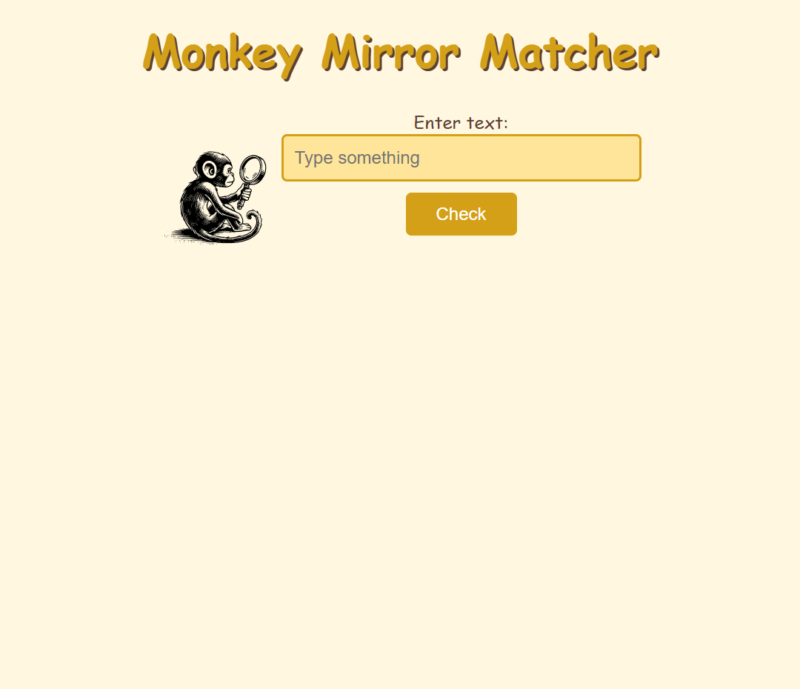
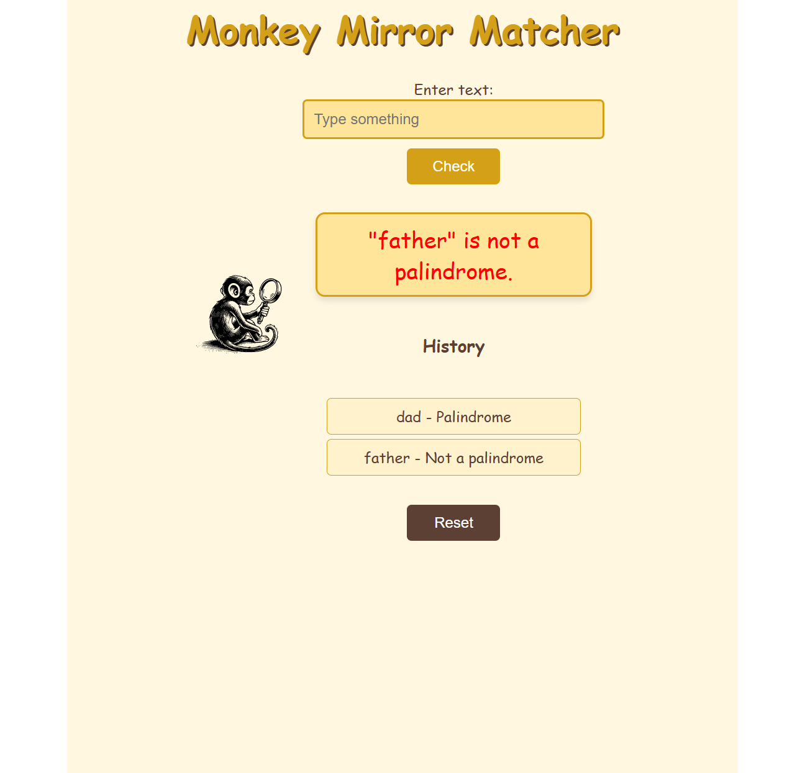

# Monkey Mirror Matcher

A palindrome checker to practice Javascript.

The User should be able to:
- Input a word and check if it is a palindrome.
- See instant feedback on their input, whether it's a palindrome or not.
- View a history of all inputs checked during the session.
- Reset the application to start fresh.

## Table of contents

- [Overview](#overview)
  - [Screenshot](#screenshot)
  - [Links](#links)
- [My process](#my-process)
  - [Built with](#built-with)
  - [What I learned](#what-i-learned)
- [Author](#author)

## Overview

### Screenshot

  
Monkey Mirror Matcher Interface

  

  
History List and Reset

  

### Links

- [Solution URL:](https://github.com/Lasse-Rodal/Palindrome-Checker-Monkey-Mirror-Matcher)
- [Live Site URL:](https://lasse-rodal.github.io/Palindrome-Checker-Monkey-Mirror-Matcher/)

## My process

### Built with

- Semantic HTML5 markup
- CSS custom properties
- JavaScript
- DOM manipulation
- Event listeners

### What I learned

In this project, I practiced:

- Validating user input.
- Dynamically show and hide elements using JavaScript.
- Using Flexbox for creating responsive layouts.
- Adding interactivity through event listeners for user actions like input submission and reset.

## Author

- Github - [Lasse Rodal Pedersen](https://github.com/Lasse-Rodal)

